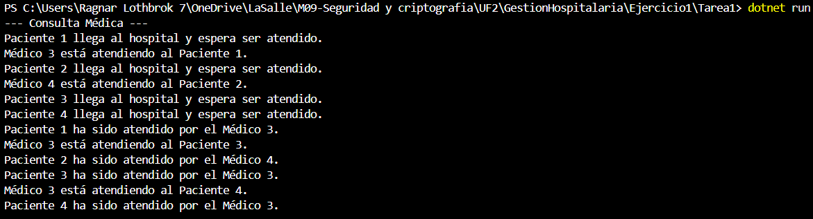

Ejercicio 1 - Tarea 1: Consulta médica

📌 Propósito

Simular la llegada de 4 pacientes al hospital y su atención médica en las 4 consultas médicas disponibles. Cada médico atiende a un paciente de forma individual con un tiempo fijo de 10 segundos.

📂 Instrucciones de Ejecución

Abre la terminal en la carpeta correspondiente (Ejercicio1/Tarea1).

Ejecuta el proyecto con el comando:

dotnet run

📸 Capturas de Pantalla

A continuación se muestra la ejecución del programa con la llegada y atención de pacientes:

❓ Preguntas y Respuestas

--¿Cuántos hilos se están ejecutando en este programa? Explica tu respuesta.

    -En este programa se están ejecutando 6 hilos simultáneamente.
        -Hilo Principal: Es el que inicia el programa y lanza las tareas.
        -Hilo Productor: Este hilo se encarga de generar pacientes y agregarlos a la cola.
        -4 Hilos Consumidores: Son los médicos que se lanzan como tareas independientes y que se encargan de atender a los pacientes uno por uno.

--¿Cuál de los pacientes entra primero en consulta? Explica tu respuesta.

    -El primer paciente que llega al hospital (Paciente 1) es generalmente el primero en entrar en consulta.
    Esto ocurre porque el hilo generador de pacientes (GenerarPacientes()) agrega al Paciente 1 a la cola antes que cualquier otro.

--¿Cuál de los pacientes sale primero de consulta? Explica tu respuesta.

    -El paciente que es atendido primero por un médico generalmente será el primero en salir.
    -La asignación aleatoria de médicos puede hacer que el orden de salida sea diferente al orden de llegada.