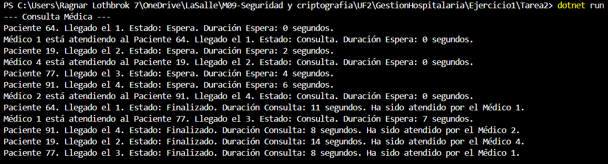

Ejercicio 1 - Tarea 2: Pacientes con datos

📌 Propósito

Esta tarea tiene como objetivo ampliar la simulación para que cada paciente tenga datos únicos y comportamientos diferentes. 
Cada paciente ahora tiene:
- Un identificador único (ID) generado aleatoriamente entre 1 y 100.
- Un tiempo de llegada al hospital registrado en segundos desde que se inicia el programa.
- Un tiempo de consulta aleatorio asignado, que varía entre 5 y 15 segundos.
- Un estado que puede ser: `Espera`, `Consulta`, `Finalizado`.

📂 Instrucciones de Ejecución

Abre la terminal en la carpeta correspondiente (Ejercicio1/Tarea2).

Ejecuta el proyecto con el comando:

dotnet run

📸 Capturas de Pantalla

❓ Preguntas y Respuestas

--¿Cuál de los pacientes sale primero de consulta? Explica tu respuesta.

    -Como el tiempo de consulta es generado aleatoriamente para cada paciente (entre 5 y 15 segundos), no se puede predecir de antemano cuál paciente saldrá primero.