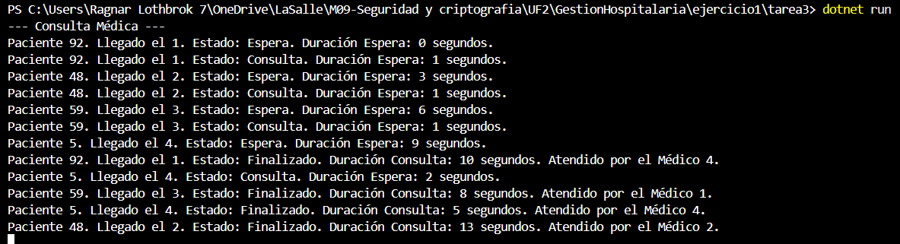

Ejercicio 1 - Tarea 3: Visualización del avance

📌 Propósito

El propósito de esta tarea es mostrar información detallada de cada paciente a medida que pasa por diferentes estados: Espera, Consulta y Finalizado. Además, se muestra el tiempo que ha pasado en cada estado (tiempo de espera y duración de consulta).

📂 Instrucciones de Ejecución

Abre la terminal en la carpeta correspondiente (Ejercicio1/Tarea3).

Ejecuta el proyecto con el comando:

dotnet run

📸 Capturas de Pantalla

❓ Pregunta

--¿Has decidido visualizar información adicional a la planteada en el ejercicio? ¿Por qué?

    -Sí, se ha decidido visualizar también el tiempo de espera antes de que un paciente entre en consulta. Esto permite ver de forma clara cuánto tiempo pasa un paciente desde su llegada hasta que es atendido por un médico. Además, se ha agregado un pequeño retraso en el mensaje inicial para que se visualice claramente el tiempo de espera antes de ser atendido por un médico, lo cual mejora la claridad de la simulación.