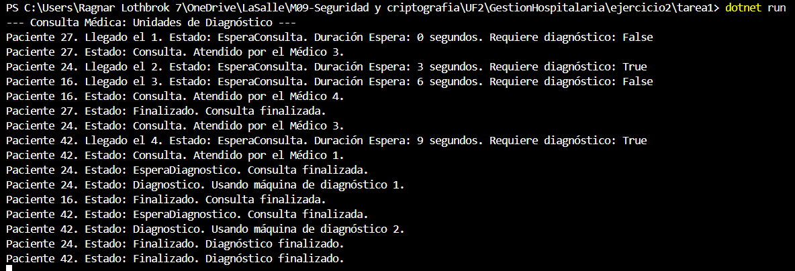

Ejercicio 2 - Tarea 1: Unidades de diagnóstico

📌 Propósito

El propósito de esta tarea es implementar un sistema de diagnóstico en el hospital donde algunos pacientes, después de pasar por la consulta con un médico, requieren realizar pruebas adicionales en una máquina de diagnóstico. Cada prueba tiene una duración fija de 15 segundos y se realiza solo si el paciente lo necesita (indicado por un atributo booleano generado aleatoriamente).

📂 Instrucciones de Ejecución

Abre la terminal en la carpeta correspondiente (Ejercicio2/Tarea1).

Ejecuta el proyecto con el comando:

dotnet run

📸 Capturas de Pantalla

❓ Pregunta

--¿Los pacientes que deben esperar para hacerse las pruebas diagnóstico entran luego a hacerse las pruebas por orden de llegada? Explica que tipo de pruebas has realizado para comprobar este comportamiento.

    -Las máquinas de diagnóstico son controladas mediante semáforos (SemaphoreSlim), que permiten el acceso exclusivo a cada máquina a un solo paciente a la vez. Sin embargo, el control sobre quién accede a la máquina no sigue un orden estricto de llegada, sino que depende de cómo el sistema operativo gestiona los hilos (threads) que están esperando por el semáforo.