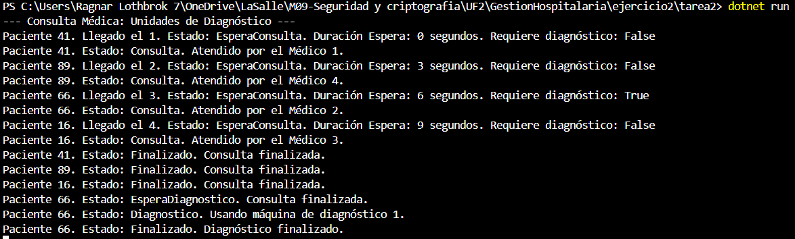

Ejercicio 2 - Tarea 2: Sincronización de pruebas

📌 Propósito

Implementar la sincronización de acceso a las máquinas de diagnóstico para que los pacientes pasen por orden de llegada, independientemente del orden de salida de la consulta.

📂 Instrucciones de Ejecución

Abre la terminal en la carpeta correspondiente (Ejercicio2/Tarea2).

Ejecuta el proyecto con el comando:

dotnet run

📸 Capturas de Pantalla

❓ Preguntas y Respuestas

--Explica la solución planteada en tu código y por qué la has escogido.

    -Para garantizar que los pacientes usen las máquinas de diagnóstico en orden de llegada, se ha implementado una BlockingCollection<Paciente> (colaDiagnostico) que almacena a todos los pacientes cuyo estado es EsperaDiagnostico. La elección de este enfoque elimina la necesidad de usar semáforos (SemaphoreSlim) para proteger la cola de diagnóstico, lo que simplifica el código y mejora la eficiencia.

-Plantea otra posibilidad de solución a la que has programado.

    -En la versión anterior, se usaba una Queue<Paciente> junto con un SemaphoreSlim para proteger el acceso a la cola. Este método era funcional pero menos eficiente.
