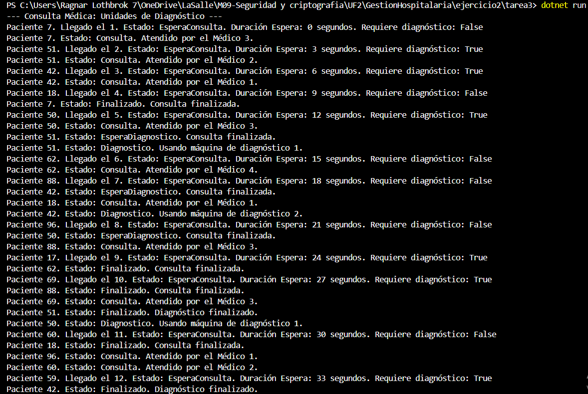
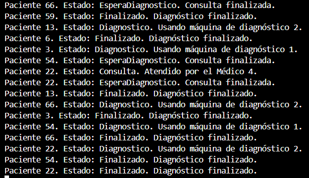

Ejercicio 2 - Tarea 3: Más pacientes

📌 Propósito

Simular la llegada de 20 pacientes al hospital con las mismas condiciones que en ejercicios anteriores, pero con la capacidad de espera para consulta si no hay médicos disponibles.

📂 Instrucciones de Ejecución

Abre la terminal en la carpeta correspondiente (Ejercicio2/Tarea3).

Ejecuta el proyecto con el comando:

dotnet run

📸 Capturas de Pantalla

    ---Siguiente foto---

    ---Siguiente foto---

❓ Preguntas y Respuestas

-¿Los pacientes que deben esperar entran luego a la consulta por orden de llegada? Explica que tipo de pruebas has realizado para comprobar este comportamiento.

    --Sí, los pacientes que deben esperar para ser atendidos por un médico entran a consulta por orden de llegada. Esto se comprueba porque:
        -Los pacientes que llegan al hospital y no encuentran un médico disponible permanecen en estado EsperaConsulta.
        -La BlockingCollection<Paciente> colaPacientes gestiona automáticamente el orden de llegada de los pacientes (FIFO).
        -Cada vez que un médico se libera, toma el siguiente paciente en la cola, respetando siempre el orden de llegada.

-Explica el planteamiento de tu código y plantea otra posibilidad de solución a la que has programado.

    -El código utiliza una BlockingCollection<Paciente> para gestionar la llegada de pacientes al hospital. Cada paciente se añade a la cola con colaPacientes.Add(paciente), y los médicos atienden a los pacientes con .GetConsumingEnumerable(), asegurando que se respete el orden de llegada. 
    -Otra posible solución sería utilizar una estructura de datos como una Queue<Paciente> con un SemaphoreSlim para proteger el acceso a la cola. Sin embargo, este método sería más complejo y menos eficiente que usar BlockingCollection que ya proporciona la sincronización necesaria de forma automática.