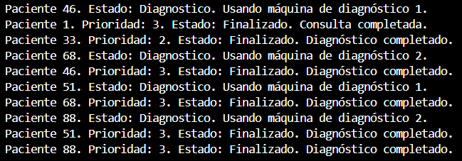

Ejercicio 2 - Tarea 4: Prioridades de los pacientes

📌 Propósito

Implementar un sistema de prioridades donde los pacientes se atienden en base a su nivel de prioridad.  
- Nivel 1: Emergencias (atendidos primero).  
- Nivel 2: Urgencias (atendidos después de las emergencias).  
- Nivel 3: Consultas generales (atendidos al final).  

📂 Instrucciones de Ejecución

1. Abre la terminal en la carpeta correspondiente (`Ejercicio2/Tarea4`).  
2. Ejecuta el proyecto con el comando:

dotnet run

📸 Capturas de Pantalla

    ---Siguiente foto---

    ---Siguiente foto---

❓ Preguntas y Respuestas

-Explica el planteamiento de tu código y plantea otra posibilidad de solución a la que has programado.

    --Planteamiento actual:
        -Utilizamos una estructura de datos PriorityQueue<Paciente, int> para manejar la prioridad de los pacientes.
        -Utilizamos lock para proteger el acceso concurrente a la cola ya que no es segura por defecto.
        -El uso de BlockingCollection para la cola de diagnóstico asegura que los pacientes que requieren diagnóstico se procesen por orden de llegada.

    --Otra posibilidad de solución:
        -Implementar un sistema basado en ConcurrentQueue y ConcurrentDictionary, donde se mantenga un diccionario con listas de pacientes ordenadas por prioridad.
        -Cada lista sería una ConcurrentQueue separada para cada nivel de prioridad (1, 2, 3).
        -Esto permitiría manejar la concurrencia de manera más eficiente sin necesidad de lock.