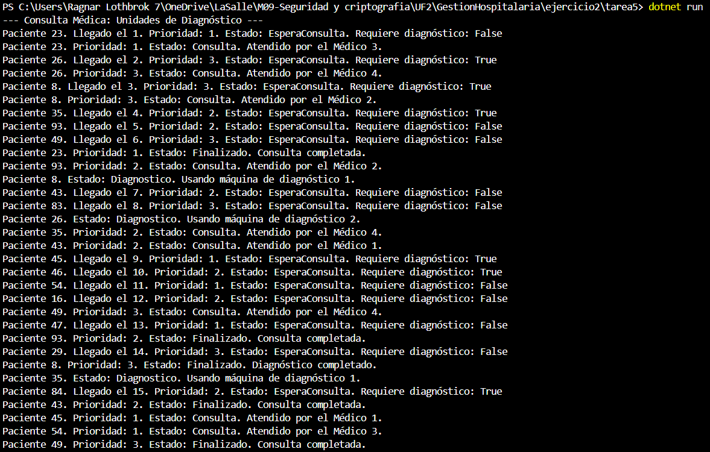
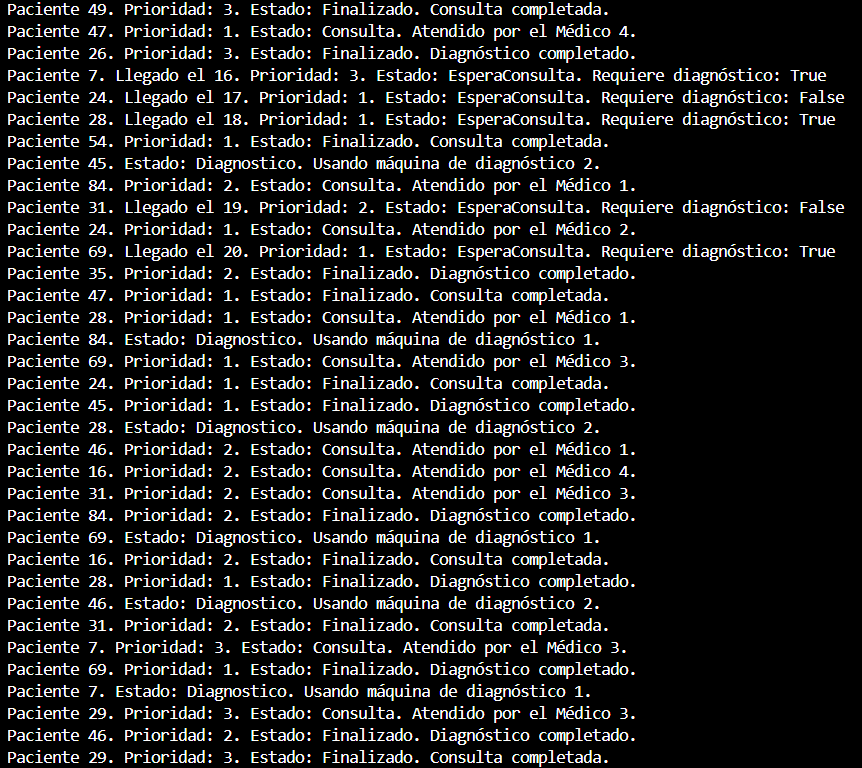
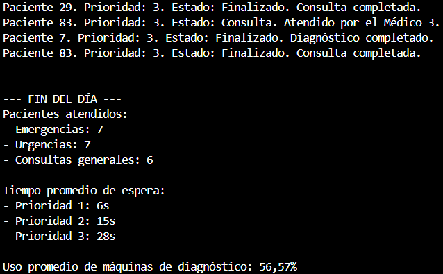

Ejercicio 2 - Tarea 5: Estadísticas y logs

📌 Propósito

Mostrar estadísticas al finalizar la simulación:

    Número total de pacientes atendidos por prioridad.

    Tiempo promedio de espera por paciente.

    Uso promedio de las máquinas de diagnóstico.

📂 Instrucciones de Ejecución

1. Abre la terminal en la carpeta correspondiente (Ejercicio2/Tarea5).
2. Ejecuta el proyecto con el comando:

dotnet run

📸 Capturas de Pantalla

    ---Siguiente foto---

    ---Siguiente foto---

❓ Preguntas y Respuestas

--¿Puedes explicar tu código y por qué has decidido hacerlo así?

    --El código ha sido diseñado para recopilar estadísticas mientras el sistema simula el flujo de pacientes en el hospital. Se han agregado variables globales que realizan un seguimiento del número de pacientes atendidos por prioridad, el tiempo de espera acumulado por prioridad, el uso de las máquinas de diagnóstico y el número de diagnósticos realizados. Además, se calcula el uso promedio de las máquinas de diagnóstico dividiendo el tiempo total que han estado en uso entre el tiempo total de la simulación. Este valor se convierte a porcentaje para mayor claridad.