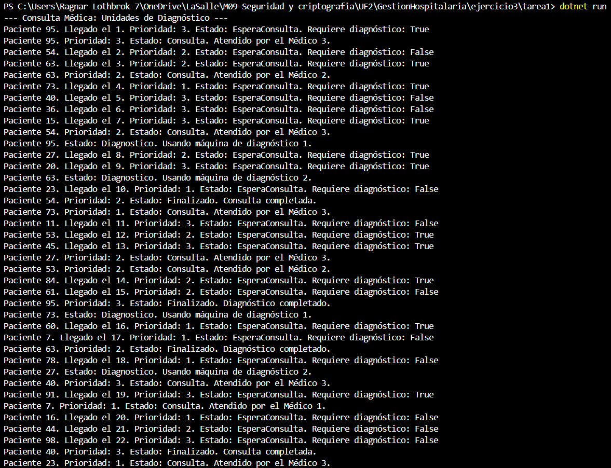
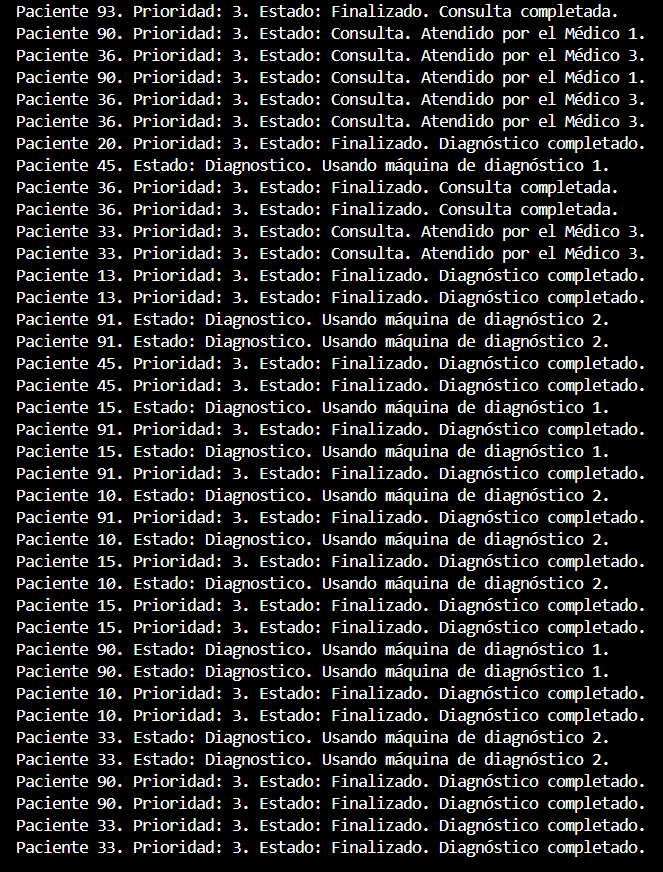
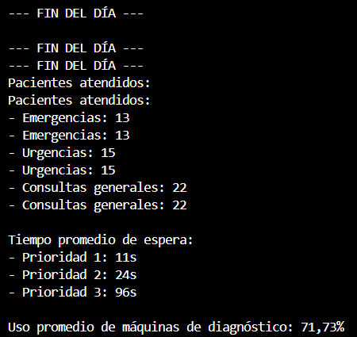
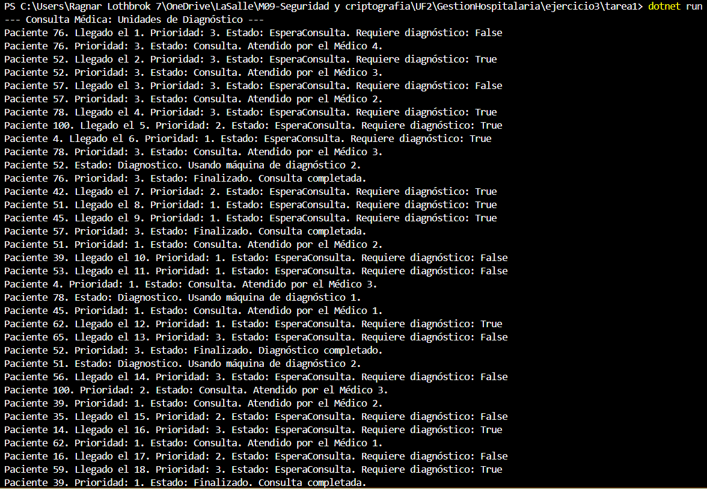
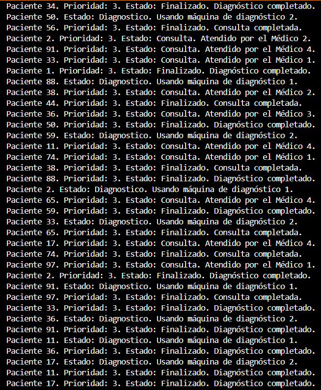
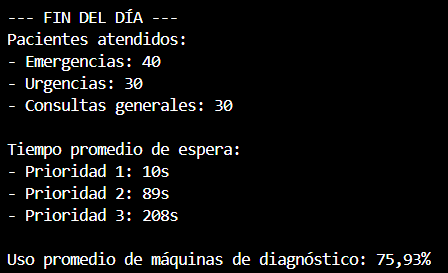

Ejercicio 3 - Tarea 1: Pacientes infinitos

📌 Propósito

Crear un generador de pacientes que funciona de manera continua generando pacientes cada 2 segundos.
Los pacientes tendrán datos diferentes de:
    -Tiempo de consulta.
    -Prioridad.
    -Diagnóstico (si requiere máquina o no).

📂 Instrucciones de Ejecución

1. Abre la terminal en la carpeta correspondiente (Ejercicio3/Tarea1).
2. Ejecuta el proyecto con el comando:

dotnet run

📸 Capturas de Pantalla

    🔍 Ejecución del Programa (Pacientes Generados de forma infinita)

    ---Siguiente foto---

    ---Siguiente foto---

    ---Siguiente foto---

    ---Siguiente foto---

    ---Siguiente foto---

    ---Siguiente foto---

    ---Siguiente foto---

    ---Siguiente foto---

    ---Siguiente foto---

    🔍 Ejecución del Programa (50 Pacientes Generados)

  ---Siguiente foto---

  ---Siguiente foto---

    🔍 Ejecución del Programa (100 Pacientes Generados)

  ---Siguiente foto---

  ---Siguiente foto---

❓ Preguntas y Respuestas

-¿Cumple con los requisitos? (Pruebas y Explicación)

    --Sí, el sistema cumple con todos los requisitos establecidos en el ejercicio. Explicaciones:

        1. Generación continua de pacientes:

            -El sistema ha generado pacientes correctamente, independientemente si la prueba se hace con 50, 100 o 1000 pacientes.

            -Todos los pacientes llegan al sistema con un estado inicial de EsperaConsulta.

        2. Atención por orden de prioridad y llegada:

            -El sistema respeta las prioridades. Los pacientes con Prioridad 1 (Emergencias) son atendidos antes que los de Prioridad 2 (Urgencias) y Prioridad 3 (Consultas Generales).

            -Los pacientes que tienen la misma prioridad son atendidos en orden de llegada.

        3. Cambio de estado correcto:

            -Los pacientes pasan correctamente por los estados: EsperaConsulta -> Consulta -> (EsperaDiagnostico) -> Diagnostico -> Finalizado.

        4. Generación de estadísticas:

            -Las estadísticas totales concuerdan perfectamente con los pacientes generados.

-¿Qué comportamientos no previstos detectas? (Pruebas y Explicación)

    --No detecto errores en la lógica general del sistema, pero sí algunos puntos que podrían mejorarse:

        1. Cuello de botella en las máquinas de diagnóstico:

            -Con 100 pacientes, el uso promedio es del 75,93%. Esto significa que las máquinas están ocupadas la mayor parte del tiempo.

            -Si el número de pacientes aumenta, las máquinas se convertirán en un cuello de botella que retrasará el procesamiento de pacientes. Habría que implementar mas máquinas.

        2. Ineficiencia en la asignación de médicos:

            -Aunque se prioriza correctamente por prioridad y orden de llegada, algunos médicos pueden estar desocupados mientras otros están sobrecargados.

            -Esto es normal si las prioridades son muy diferentes, pero puede ser optimizable con un mejor sistema de asignación.

-¿Cómo adaptarías tu solución para estos nuevos escenarios?

    --Para manejar correctamente escenarios con más pacientes, o pacientes infinitos, propondría las siguientes adaptaciones:

        1. Aumentar el número de máquinas de diagnóstico:

            -Incrementar el número de máquinas de diagnóstico de 2 a 4 o más para mejorar la eficiencia.

            -Esto reducirá el tiempo de espera de pacientes que requieren diagnóstico y evitará cuellos de botella.

        2. Mejorar la asignación de médicos:

            -Implementar un sistema de asignación dinámica que considere la carga actual de cada médico.

            -Esto permitiría que un médico que termine una consulta pueda atender rápidamente a un paciente nuevo, sin importar si otro médico está ocupado.

        3. Guardar registros en archivos en lugar de imprimir en consola:

            -Para evitar ralentizaciones debido a la impresión constante en pantalla.

        4. Implementar un sistema de prioridades mejorado:

            -En situaciones con muchos pacientes, implementar un sistema que revise periódicamente si algún paciente con alta prioridad está esperando demasiado tiempo.