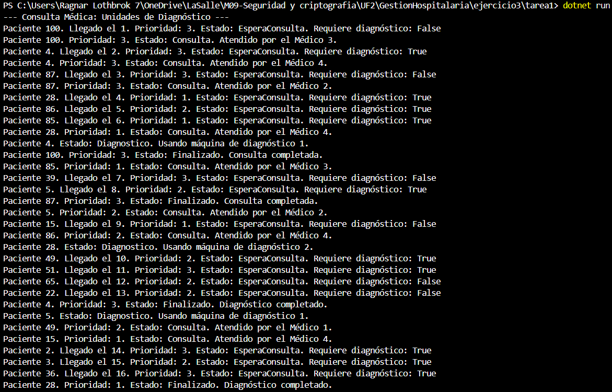
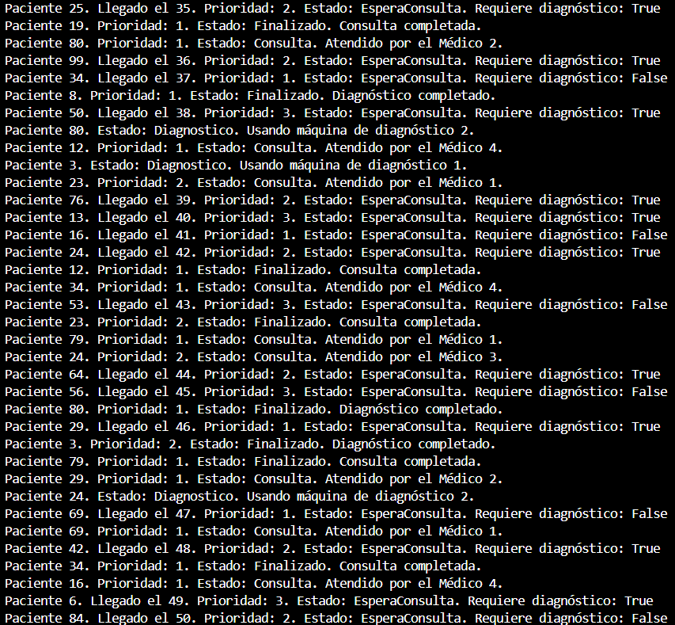
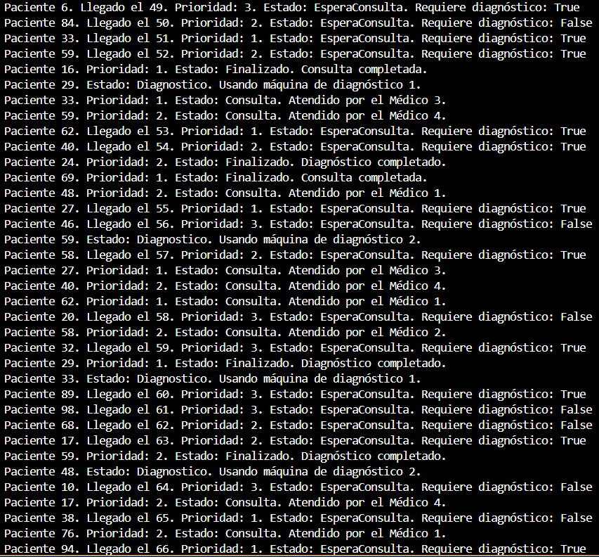
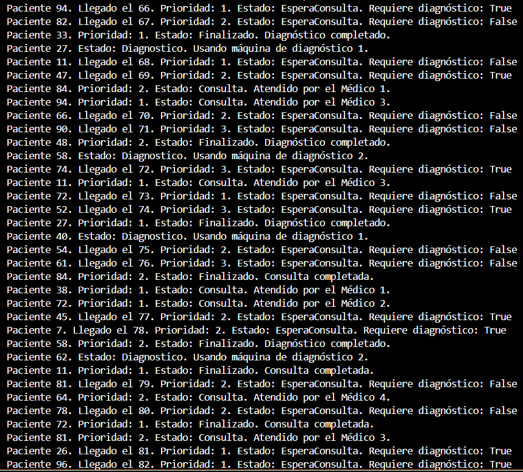
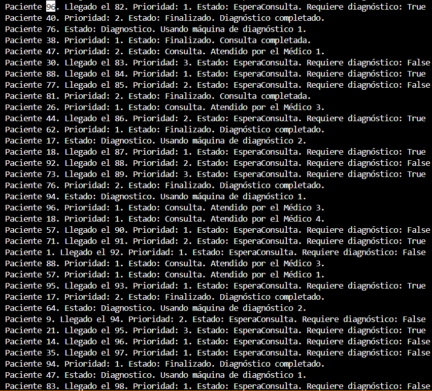
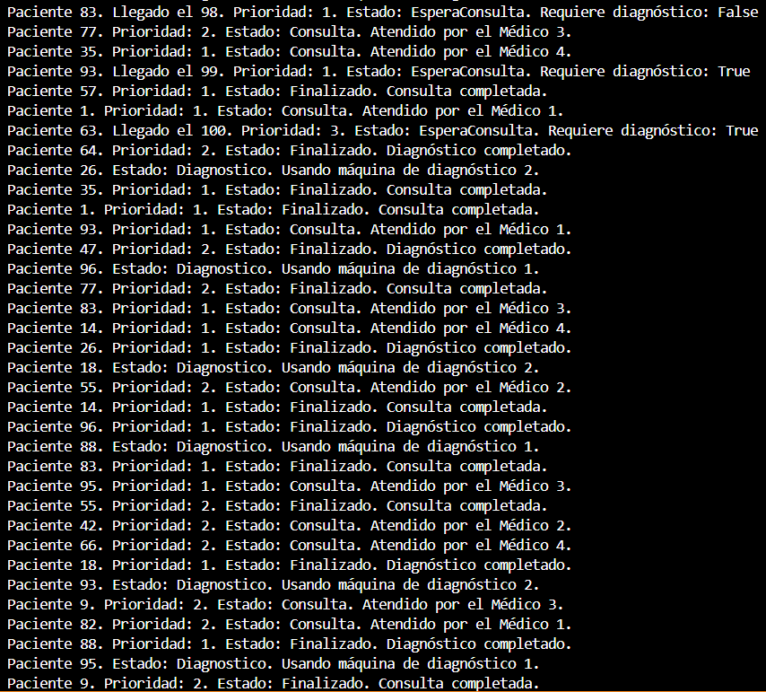
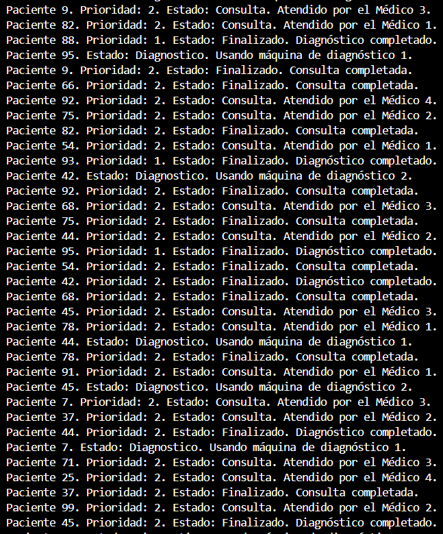
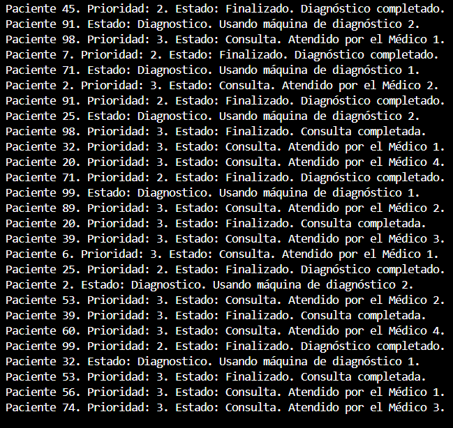
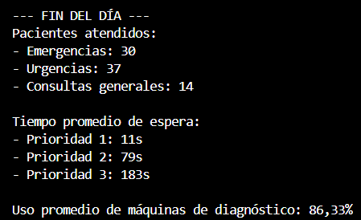

Ejercicio 3 - Tarea 1: Pacientes infinitos

📌 Propósito

Crear un generador de pacientes que funciona de manera continua generando pacientes cada 2 segundos.
Los pacientes tendrán datos diferentes de:
    -Tiempo de consulta.
    -Prioridad.
    -Diagnóstico (si requiere máquina o no).

📂 Instrucciones de Ejecución

1. Abre la terminal en la carpeta correspondiente (Ejercicio3/Tarea1).
2. Ejecuta el proyecto con el comando:

dotnet run

📸 Capturas de Pantalla

    ---Siguiente foto---

    ---Siguiente foto---

    ---Siguiente foto---

    ---Siguiente foto---

    ---Siguiente foto---

    ---Siguiente foto---

    ---Siguiente foto---

    ---Siguiente foto---

    ---Siguiente foto---

❓ Preguntas y Respuestas

¿Cumple con los requisitos? (Pruebas y Explicación)
[Respuesta]

¿Qué comportamientos no previstos detectas? (Pruebas y Explicación)
[Respuesta]

¿Cómo adaptarías tu solución para estos nuevos escenarios?
[Respuesta]